# Custom Standard Cell Design using Skywater 130nm PDK
This repository provides a flow for doing custom standard cell design for Skywater 130nm PDK using open-source tools. The proposed flow uses NGSPICE for simulation, Magic for layout, and python scripts in conjunction with NGSPICE control commands to generate timing liberty files.
<p align="center">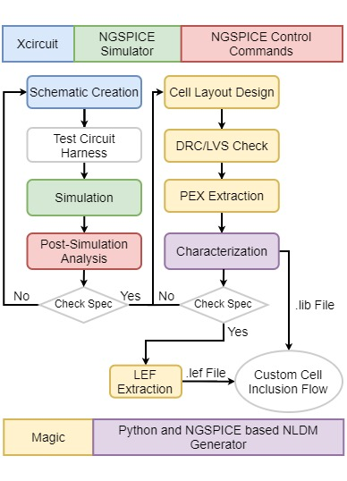</p>     

#### Under Development
- [Custom Standard Cell Design using Skywater 130nm PDK](#custom-standard-cell-design-using-skywater-130nm-pdk)
      - [Under Development](#under-development)
  - [What is Non Linear Delay Model(NLDM)?](#what-is-non-linear-delay-modelnldm)
  - [Custom Standard Cell List and Pre-layout Results](#custom-standard-cell-list-and-pre-layout-results)
  - [Instruction to generate Timing liberty file](#instruction-to-generate-timing-liberty-file)
  - [Verification of generated liberty file with OpenSTA](#verification-of-generated-liberty-file-with-opensta)
  - [Future Works:](#future-works)

## What is Non Linear Delay Model(NLDM)?

NLDM is derived from SPICE characterizations and is a highly reliable timing model. The table model is referred to as an NLDM and is used to measure the
delay, performance slew, or other timing checks. Most of the cell libraries used table models to specify the delay and timing checks for different cell timing arcs.

For different combinations of input at the cell input pin and multiple output capacitance at the cell output pin, the table provides the delay through the
cell. In a two-dimensional array, where the two independent variables are the input transition and the capacitance of the output load and the entries in the table 
are the delays.
The characterization is performed using the ngspice open source circuit simulator.        
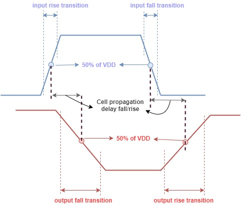 

The time taken by a signal to increase from 20 percent to 80 percent of its maximum value is known as transition delay or slew. This is referred to as "rise time".
Similarly, it is possible to describe "fall time" as the time taken by a signal to fall from 80 to 20 percent of its maximum value.

The time taken for a signal to propagate through a gate or net is the propagation delay.
Therefore, you can call it a "Gate or Cell Delay" if it is a cell.
The time it takes for a signal at the input pin to impact the output signal at the output pin is the propagation delay of a gate or cell.
A delay of 50 percent of the input transition to the corresponding 50 percent of the output transition is calculated for any gate propagation.

Considering the rise/fall of both input and output, we are faced with four propagation delays: 
  1. 50% of input rise to 50% of output rise.
  2. 50% of input rise to 50% of output fall.
  3. 50% of input fall to 50% of output rise.
  4. 50% of input fall to 50% of output fall.
  
All the delays will have different values, or in some cases same values.
 
## Custom Standard Cell List and Pre-layout Results
  1. [nand2_1x](custom_stdcell/nand2_1x/nand2.spice) |  [ Timing Lib File](custom_stdcell/nand2_1x/timing.lib)          
      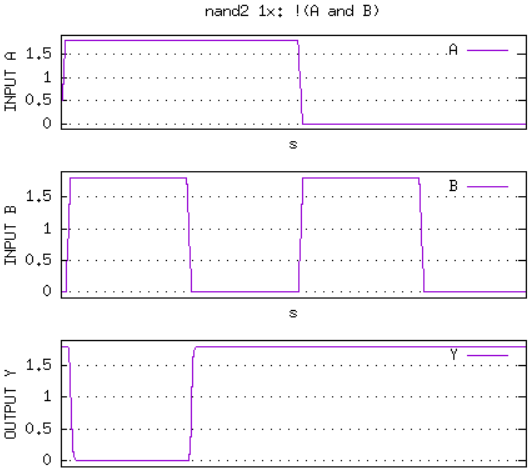        
  2. [nand2_2x](custom_stdcell/nand2_2x/nand2_2x.spice) |  [ Timing Lib File](custom_stdcell/nand2_2x/timing.lib)     
      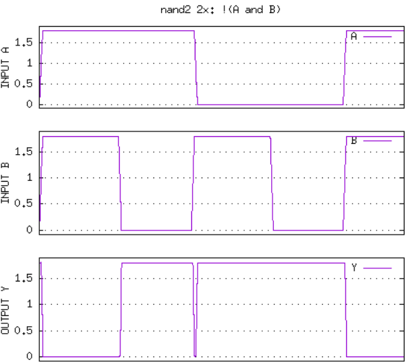  
  3. [nand3_1x](custom_stdcell/nand3_1x/nand3_1x.spice) |  [ Timing Lib File](custom_stdcell/nand3_1x/timing.lib)             
      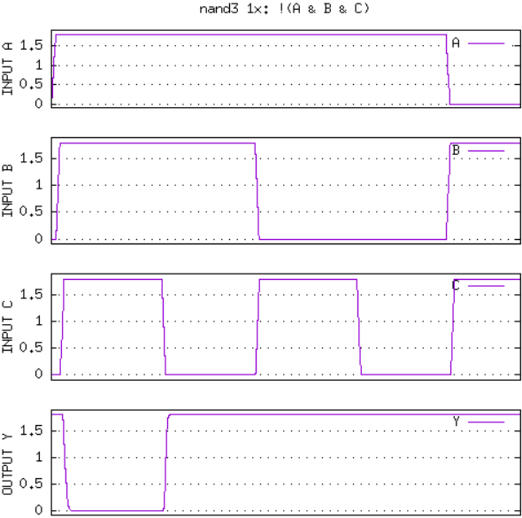      
  4. [nand3_2x](custom_stdcell/nand3_2x/nand3_2x.spice) |  [ Timing Lib File](custom_stdcell/nand3_2x/timing.lib)       
      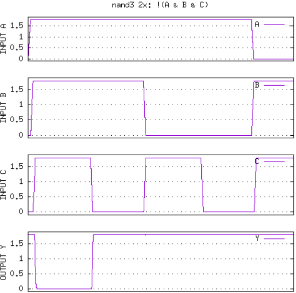   
  5. [nand4_1x](custom_stdcell/nand4_1x/nand4_1x.spice) |  [ Timing Lib File](custom_stdcell/nand4_1x/timing.lib)     
      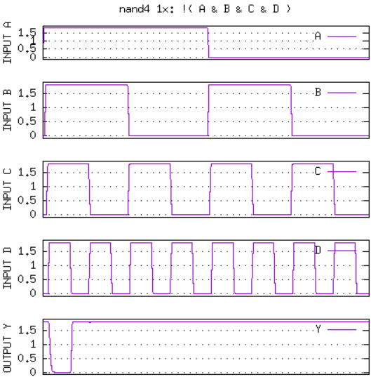   
  6. [nand4_2x](custom_stdcell/nand4_2x/nand4_2x.spice) |  [ Timing Lib File](custom_stdcell/nand4_2x/timing.lib)     
      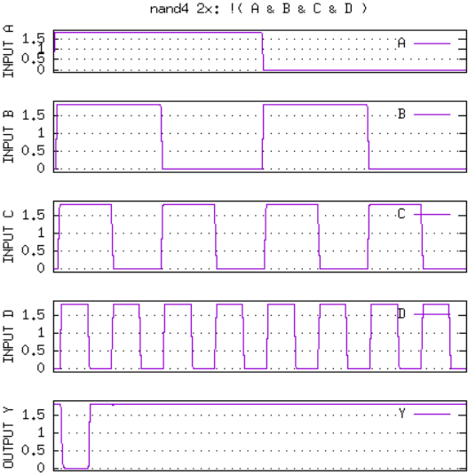      
  7. [o21ai_1x](custom_stdcell/o21ai_1x/o21ai_1x.spice) |  [ Timing Lib File](custom_stdcell/o21ai_1x/timing.lib)     
      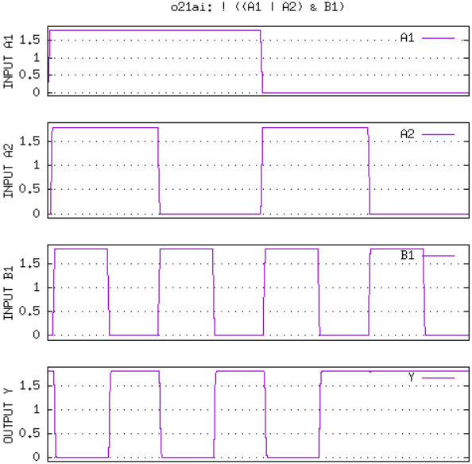
  8. [o22ai_1x](custom_stdcell/o22ai_1x/o22ai_1x.spice)  |  [ Timing Lib File](custom_stdcell/o22ai_1x/timing.lib)      
      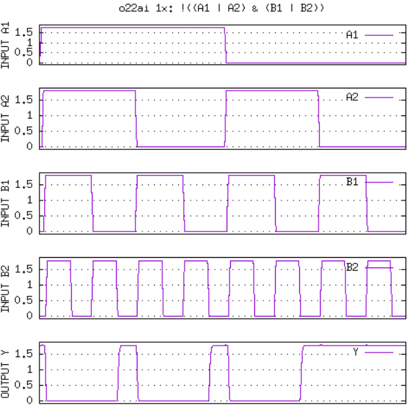
  9.  [o221ai_1x](custom_stdcell/o221ai_1x/o221ai_1x.spice)  |  [ Timing Lib File](custom_stdcell/o221ai_1x/timing.lib)       
      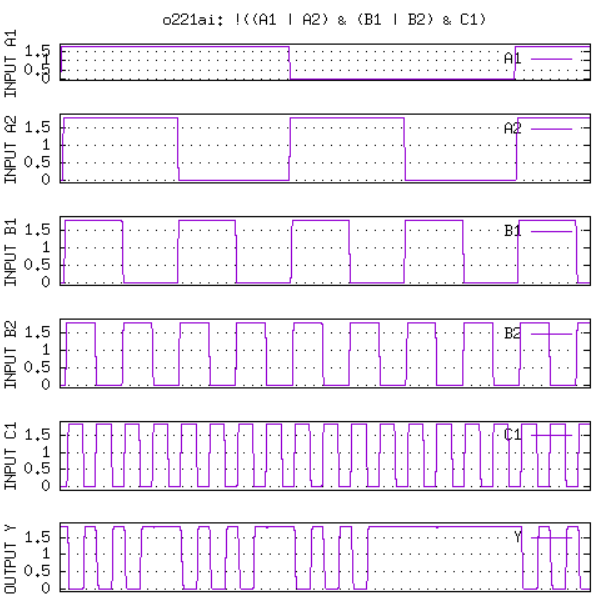       
  10.  [o2111ai_1x](custo_stdcell/../custom_stdcell/o2111ai_1x/o2111ai_1x.spice)  |  [ Timing Lib File](custom_stdcell/o2111ai_1x/timing.lib)     
      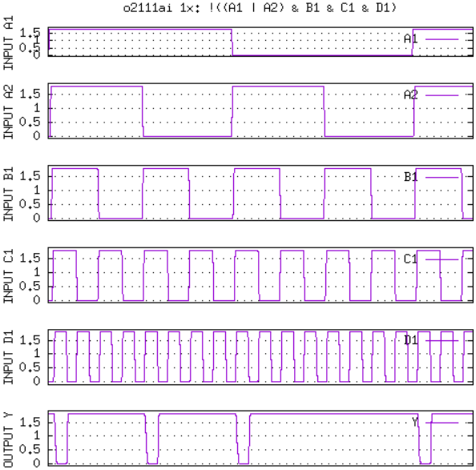      

## Instruction to generate Timing liberty file
**Step 0: Perquisites based on Ubuntu OS**      
  * Software Requirements: NGSPICE and python 3     
  * Clone the repository: `$ git clone https://github.com/harshsrigh/timing_archs.git`        
  * Change Directory to timing_arch: `$ cd timing_arch`
  * All the commands need to be run from the root directory i.e `user_name@PC_name:~/timing_archs$`

**Step 1: Edit config.py**
   * Enter custom cell folder and spice file that needs to be characterized.
   * Mention input vectors for input delay and load capacitor.
   * Mention Input and Output pins.
   * Enter Logic function.

**Nand3_2x example:**  [nand3_2x config.py](config.py)      
                 
  * Replace 'custom_stdcell/nand3_2x/' directory with your cell working directory in config.py file.
  * Similarly replace spice file name 'nand3_2x.spice' with your spice file name. Make sure the spice format has the subckt inside it with proper scaling factor.     
    
    File Configuration:
    ``` py
    library_directory = ''
    library_file = path.join(library_directory, 'sky130nm.lib')
    cell_directory = 'custom_stdcell/nand3_2x/' # Enter cell folder
    spice_file = path.join(cell_directory, "nand3_2x.spice") # Enter .spice file
    output_folder =  path.join(cell_directory, "data")
    ```             
    Input Vector:
    ``` py
    input_delay = '0.01n 0.023n 0.0531329n 0.122474n 0.282311n 0.650743 1.5n' # Only put the unit(do not include sec suffix)
    output_caps = '0.0005p 0.0012105800p 0.002931p 0.00709641p 0.0171815 0.0415991p 0.100718p' # Only put the unit(do not include Farad suffix)
    input_pins = 'A B C' # TODO: extract from .lef files
    output_pins = 'Y' # TODO: extract from .lef files
    logic_function = 'not (A and B and C)' # Use keyword 'not', 'and' 'or'
    ```         

**Step 2: Execute python file**       
    Enter command into terminal: `$ python3 combchar.py`

**Step 3: Ideal Run Final Output**:                             
    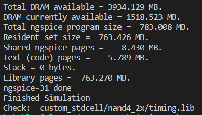

## Verification of generated liberty file with OpenSTA
* Perquisites openSTA software. You could install using `sudo apt-get install openSTA'
* change directory to sta_results: `$ cd sta_results`
* Copy the generated cell group of your standard cell to `sky130_fd_sc_hd__tt_025C_1v80.lib` as done for `vsdcell_nand3_2x`
* Edit the sta.conf and my_base.sdc as per your requirement.
* Run OpenSTA using command: `$ sta sta.conf`.
* Verify your cell of interest and make sure there is no warning due the liberty files.       
    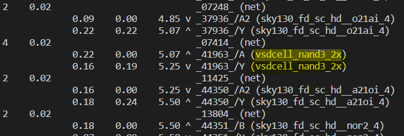
## Future Works: 
**(Focused on Combination circuits only without tri-state/HiZ)**
* Test .lib files using openSTA tool.
* Perform Layout on these 10 cells.
* Setup Power calculation harness for leakage power and internal power(total power - dynamic power)
* Internal pin capacitance calculations
