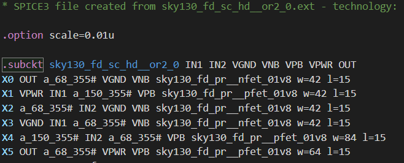

# Semi-Automated Non Linear Delay Model Generator using NGSPICE
The flow uses control commands based on ngspice to construct the Non-Linear Delay Model(NLDM) for the custom standard cell. This repo aims to introduce an approach of using open-source resources to do custom cell characterization.

- [Semi-Automated Non Linear Delay Model Generator using NGSPICE](#semi-automated-non-linear-delay-model-generator-using-ngspice)
  - [Prerequisite](#prerequisite)
  - [What is Non Linear Delay Model(NLDM)?](#what-is-non-linear-delay-modelnldm)
    - [Define Cell Rise, Cell Fall, Rise Transition and Fall Transition?](#define-cell-rise-cell-fall-rise-transition-and-fall-transition)
  - [Proposed Flow for Timing Characterization?](#proposed-flow-for-timing-characterization)
  - [Explaining Flow using OR Gate example](#explaining-flow-using-or-gate-example)
    - [NGSPICE File Setup](#ngspice-file-setup)
    - [Process for Text File Creation](#process-for-text-file-creation)
    - [Timing Block .lib Format Generation](#timing-block-lib-format-generation)
    - [Comparison of Timing values from Skywater130nm PDK](#comparison-of-timing-values-from-skywater130nm-pdk)

## Prerequisite 

## What is Non Linear Delay Model(NLDM)?

### Define Cell Rise, Cell Fall, Rise Transition and Fall Transition? 

## Proposed Flow for Timing Characterization?

## Explaining Flow using OR Gate example
Start with simple schematic design using Xcircuit or any schematic capture tool and generate spice file subckt as shown below               

Once this file is created, we are ready to perform NGSPICE simulation.

### NGSPICE File Setup
This setup is divided into three sections:
1. **Adding Required Libraries and Sub-circuit:**
### Process for Text File Creation

### Timing Block .lib Format Generation

### Comparison of Timing values from Skywater130nm PDK
