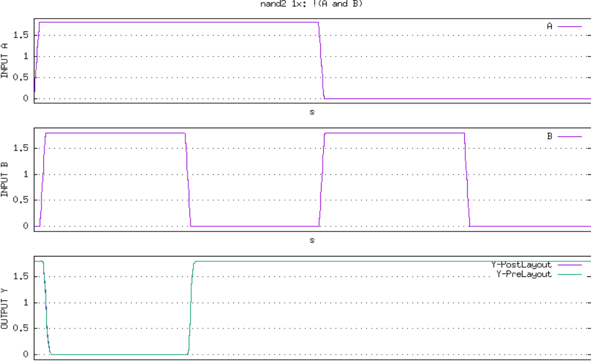

# Custom Standard Cell Design with a automated Non-Linear-Delay-Model Generator
The flow uses control commands based on ngspice to construct the Non-Linear Delay Model(NLDM) for the custom standard cell. This repo aims to introduce an approach of using open-source resources to do custom cell characterization.
#### Under Development
- [Custom Standard Cell Design with a automated Non-Linear-Delay-Model Generator](#custom-standard-cell-design-with-a-automated-non-linear-delay-model-generator)
      - [Under Development](#under-development)
  - [What is Non Linear Delay Model(NLDM)?](#what-is-non-linear-delay-modelnldm)
  - [Custom Standard Cell List and Pre-layout Results](#custom-standard-cell-list-and-pre-layout-results)

## What is Non Linear Delay Model(NLDM)?

NLDM is derived from SPICE characterizations and is a highly reliable timing model. The table model is referred to as an NLDM and is used to measure the
delay, performance slew, or other timing checks. Most of the cell libraries used table models to specify the delay and timing checks for different cell timing arcs.

For different combinations of input at the cell input pin and multiple output capacitance at the cell output pin, the table provides the delay through the
cell. In a two-dimensional array, where the two independent variables are the input transition and the capacitance of the output load and the entries in the table 
are the delays.
The characterization is performed using the ngspice open source circuit simulator.        
 

The time taken by a signal to increase from 20 percent to 80 percent of its maximum value is known as transition delay or slew. This is referred to as "rise time".
Similarly, it is possible to describe "fall time" as the time taken by a signal to fall from 80 to 20 percent of its maximum value.

The time taken for a signal to propagate through a gate or net is the propagation delay.
Therefore, you can call it a "Gate or Cell Delay" if it is a cell.
The time it takes for a signal at the input pin to impact the output signal at the output pin is the propagation delay of a gate or cell.
A delay of 50 percent of the input transition to the corresponding 50 percent of the output transition is calculated for any gate propagation.

Considering the rise/fall of both input and output, we are faced with four propagation delays: 
  1. 50% of input rise to 50% of output rise.
  2. 50% of input rise to 50% of output fall.
  3. 50% of input fall to 50% of output rise.
  4. 50% of input fall to 50% of output fall.
  
All the delays will have different values, or in some cases same values.
 
## Custom Standard Cell List and Pre-layout Results
  1. [nand2_1x](custom_stdcell/nand2_1x/nand2.spice) |  [ Timing Lib File](custom_stdcell/nand2_1x/timing.lib)          
              
  2. [nand2_2x](custom_stdcell/nand2_2x/nand2_2x.spice) |  [ Timing Lib File](custom_stdcell/nand2_2x/timing.lib)     
        
  3. [nand3_1x](custom_stdcell/nand3_1x/nand3_1x.spice) |  [ Timing Lib File](custom_stdcell/nand3_1x/timing.lib)             
            
  4. [nand3_2x](custom_stdcell/nand3_2x/nand3_2x.spice) |  [ Timing Lib File](custom_stdcell/nand3_2x/timing.lib)       
         
  5. [nand4_1x](custom_stdcell/nand4_1x/nand4_1x.spice) |  [ Timing Lib File](custom_stdcell/nand4_1x/timing.lib)     
         
  6. [nand4_2x](custom_stdcell/nand4_2x/nand4_2x.spice) |  [ Timing Lib File](custom_stdcell/nand4_2x/timing.lib)     
            
  7. [o21ai_1x](custom_stdcell/o21ai_1x/o21ai_1x.spice) |  [ Timing Lib File](custom_stdcell/o21ai_1x/timing.lib)     
      
  8. [o22ai_1x](custom_stdcell/o22ai_1x/o22ai_1x.spice)  |  [ Timing Lib File](custom_stdcell/o22ai_1x/timing.lib)      
      
  9.  [o221ai_1x](custom_stdcell/o221ai_1x/o221ai_1x.spice)  |  [ Timing Lib File](custom_stdcell/o221ai_1x/timing.lib)       
             
  10.  [o2111ai_1x](custo_stdcell/../custom_stdcell/o2111ai_1x/o2111ai_1x.spice)  |  [ Timing Lib File](custom_stdcell/o2111ai_1x/timing.lib)     
            

